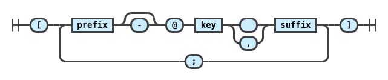
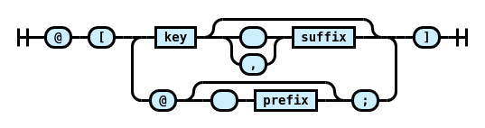

# `micromark-extension-cite`

A **[`micromark`](https://github.com/micromark/micromark)** syntax extension for [`pandoc`-style](https://pandoc.org/MANUAL.html#extension-citations) citations, providing the low-level modules for integrating with the micromark tokenizer and the micromark HTML compiler.

You probably shouldn’t use this package directly, but instead use [`mdast-util-cite`](https://github.com/benrbray/remark-cite/tree/master/mdast-util-cite) with [mdast](https://github.com/syntax-tree/mdast) or [`remark-cite`](https://github.com/benrbray/remark-cite/tree/master/remark-cite) with [remark](https://github.com/remarkjs/remark).

## Install

Install [`@benrbray/micromark-extension-cite`]() on `npm`.

```
npm install @benrbray/micromark-extension-cite 
```

## Syntax Diagram

A `micromark` syntax extension is basically a state machine that operates on a character stream to produce a stream of tokens that can later be assembled into a syntax tree by `mdast`.  The following diagrams, produced by [`grammkit`](https://dundalek.com/grammkit), give a rough sketch of the state machine:

**Pandoc Syntax**



**Alternate Syntax**



Of course, since the code for this extension was written by hand, rather than by a parser generator, the correspondence is not exact.  A future project might be to convert PEG grammars to `micromark` syntax extensions, in an attempt to escape the third and fourth certainties in life:  bugs and boilerplate. :)

## Design Choices

Mostly to reduce complexity, the syntax supported by this extension differs from [`pandoc` citation syntax](https://pandoc.org/MANUAL.html#extension-citations) in the following ways:

* To avoid recognizing email addresses as citations, we require the prefix, when it exists, to end with a space character.
* Unlike Pandoc, we make no distinction between the "locator" and "suffix".

These choices are not set in stone, so feel free to open an issue to discuss possible changes.