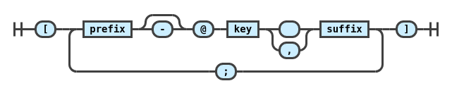
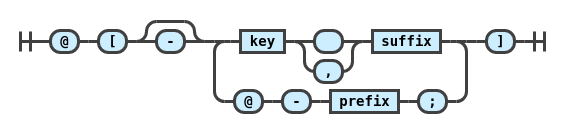

# `micromark-extension-cite`

A **[`micromark`](https://github.com/micromark/micromark)** syntax extension for [`pandoc`-style](https://pandoc.org/MANUAL.html#extension-citations) citations, providing the low-level modules for integrating with the micromark tokenizer and the micromark HTML compiler.

You probably shouldn’t use this package directly, but instead use [`mdast-util-cite`](https://github.com/benrbray/remark-cite/tree/master/mdast-util-cite) with [mdast](https://github.com/syntax-tree/mdast) or [`remark-cite`](https://github.com/benrbray/remark-cite/tree/master/remark-cite) with [remark](https://github.com/remarkjs/remark).

## Install

Install [`@benrbray/micromark-extension-cite`]() on `npm`.

```
npm install @benrbray/micromark-extension-cite 
```

## Usage

```javascript
import micromark from "micromark";
import { citeSyntax, citeHtml } from "micromark-extension-cite";

let serialized = micromark('[see @wadler1989, sec. 1.3; and @hughes1990, pp.4]', {
    extensions: [citeSyntax()],
    htmlExtensions: [citeHtml()]
});
```

The serialized result will be the following.  To get an abstract syntax tree, use `mdast-util-cite` instead.

```html
<p><span class="citation" data-cites="wadler1989 hughes1990">
[see @wadler1989, sec. 1.3; and @hughes1990, pp.4]
</span></p>
```

### Configuration Options

#### `options.enablePandocSyntax [boolean]`

Enable the pandoc-style syntax, `[@wadler1989]`.  A single citation can cite multiple items, and each individual item can have a prefix and suffix.  The default is `true`.  Authors can be suppressed with a hyphen `-`.

#### `options.enableAltSyntax [boolean]`

Enable the alternative syntax, `@[wadler1989]`.  A single citation can site multiple items, but the first item cannot have a prefix.  Authors can be suppressed with a hyphen `-`.

## Syntax

By default, this extension supports `pandoc`-style syntax, where each citation item can have a prefix, suffix, and key.  Include a hyphen `-` before an `@` symbol to indicate that the author name should be suppressed.

```
[@wadler1989:comprehending-monads]
[see @wadler1989, pp. 80; and @hughes1990; also @peyton-jones2003]
[-@wadler1989; and @hughes1990]
```

With the `enableAltSyntax` option, you can place the first `@` symbol before the opening bracket.  When using the alternative syntax, the first item cannot have a prefix.  The first item *can* be suppressed with a leading hyphen `-`.

```
@[wadler1989:comprehending-monads]
@[wadler1989, pp. 80; and @hughes1990; but don't forget @peyton-jones2003]
@[-wadler1989; and @hughes1990]
```

### Railroad Diagrams

A `micromark` syntax extension is basically a state machine that operates on a character stream to produce a stream of tokens that can later be assembled into a syntax tree by `mdast`.  The following diagrams, produced by [`grammkit`](https://dundalek.com/grammkit), give a rough sketch of the state machine:

**Pandoc Syntax**



**Alternate Syntax**



Of course, since the code for this extension was written by hand, rather than by a parser generator, the correspondence is not exact.  A future project might be to convert PEG grammars to `micromark` syntax extensions, in an attempt to escape the third and fourth certainties in life:  bugs and boilerplate. :)

## Differences from `pandoc`

Mostly to reduce complexity, the syntax supported by this extension differs from [`pandoc` citation syntax](https://pandoc.org/MANUAL.html#extension-citations) in the following ways:

* To avoid recognizing email addresses as citations, we require the prefix, when it exists, to end with a space character.
* Unlike Pandoc, we make no distinction between the "locator" and "suffix".

These choices are not set in stone, so feel free to open an issue to discuss possible changes.